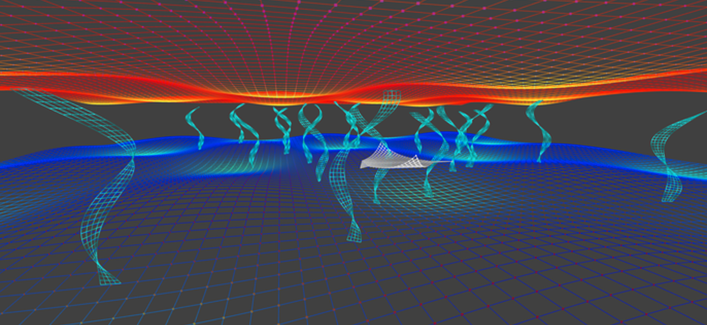

# 🧬 biosis 🃏
Validator nodes have the ability to set a public record for block proposals on a network. I've yet to see this be used in a creative or useful way.

Question: Can hardware validators for certain blockchains include other types of staking methods to publically showcase the collective intelligence of a network, like that of what makes humans unique. Since Gnosis Chain will be working ~ 2 weeks ahead of the Ethereum Beacon Chain, validators also become 'downstream' Oracles for other people in the ecosystem?

Graffiti comes from the Italian word graffere, which means 'to scratch on a surface.' This 'scratching' can be done on any surface with any implement, permanent or not.

## Modes of Graffiti
- Upload an NFT media URI, for any artwork
- Upload a recent Tarot Card Pull that represents certain quantum measurements in a node operators future, only relevant for a certain period of time.
- Upload a recent epoch in some type of bio-feedback health status, like that of a non-invasive brain-computer interface to signify a vote on attention.

## Flow
Upload an NFT as the default base. If there is a recent tarot pull, add this to your validator. Have this pull only be applied once to a block. If a validator has been chosen and a person has BCI data connected to a recent epoch, use this instead.

->|NFT|NFT|Tarot|NFT|BCI|BCI|BCI|BCI|Tarot|->

The point is to get into a ritual for readings & stake some peice of bio-data.

## Use Cases
I like to think of staking as a method of putting some peice of 'worth' on the line for movements in direction. You take stake on where you live. But what if we can use this public staking record to do more, with possibly building new community digital spaces or decentralized medical institutions for the purpose of using additional bits of information to vote on matters for the sake of public good.

## Example Visual

Epoch to epoch, collective frequencies hold validation together.

Who wants to play?
